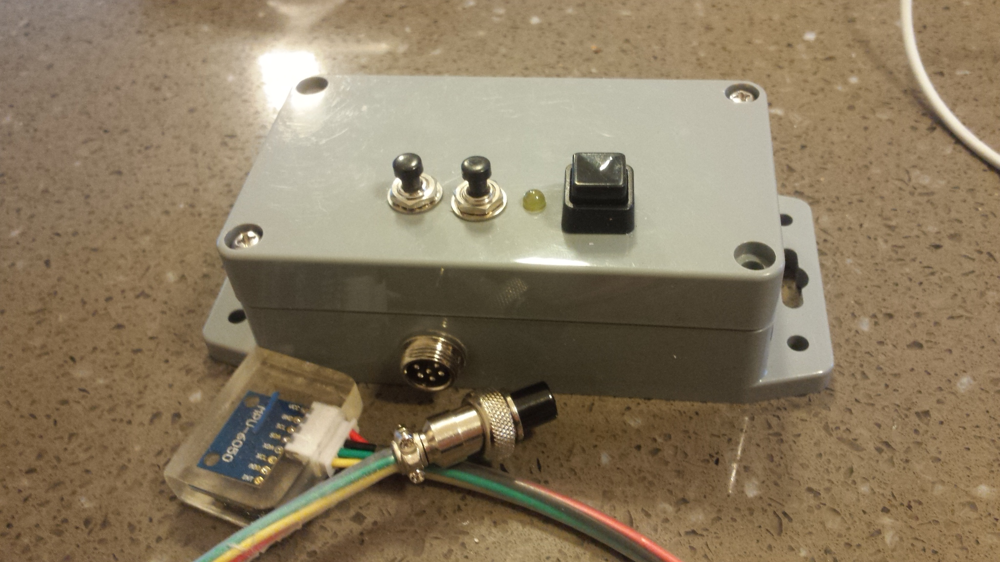

# vibe

This is a small project to capture vibration and temperature data from an MPU6050 sensor onto an ESP8266, package the data into JSON & deliver to IBM IoT Platform.  The data is then displayed in a Node Red dashboard.

There are 3 major components to the project.

Hardware
--------
The hardware consists of an MPU6050 sensor connected to an ESP8266 MCU.  A bare ESP8266 mounted on an adapter plate was chosen for this project to keep current usage to a minimum.  When in deep sleep mode, the MCU draws <50 micro amps.  When running on an development board several milliamps are drawn even in deep sleep mode.

MCU Software
------------
A small C++ application is used to capture the data via I2C from the MPU6050.  Time domain acceleration data is read into an array.  FFT code is then used to translate into the frquency domain.  The code now handles up to 500Hz frequency detection.  In addition to the frequency spectrum, maximum acceleration and temperature is also captured from the sensor.  A JSON package is constructed and sent via MQTT to the IBM IoT Platform using the PubSub library.

Note that the first time you use an ESP8266 you must condition the SPIFFS (Flash Memory).  There are two lines (one in the main code and one in Spiffs.ino) to uncomment.  Compile & run untill you see "Done".  Then comment them out for production use.

Node Red Software
-----------------
The Node Red flow simply captures the data from IoT Platform and displays it in a Dasboard.  The code is able to distinguish between multiple devices of the same type sending data and allows you to select the particular device to display.
